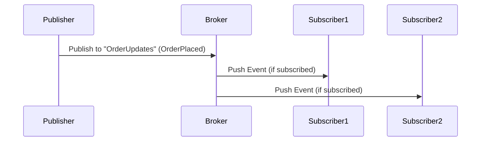
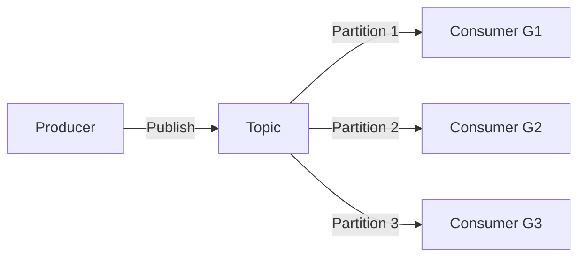

---
cssclasses:
  - center-images
  - center-titles
---
Tags: #system-design

# 11_System Design

# **Publisher/Subscriber (Pub/Sub) Model 

---

## **1. What is the Pub/Sub Model?**  
A messaging pattern where:  
- **Publishers** send messages (events) to a **topic/channel** (without knowing who receives them).  
- **Subscribers** listen to topics they’re interested in.  

**Key Idea**: Decouples senders (publishers) and receivers (subscribers).  

### **Real-World Analogy**  
Think of a **newsletter**:  
- **Publisher**: News agency (sends emails).  
- **Subscribers**: People who opt-in (receive only topics they chose).  

---

## **2. Core Concepts**  
### **A. Publisher (Producer)**  
- Generates messages/events (e.g., "OrderPlaced").  
- **Does not know** who receives the message.  

### **B. Subscriber (Consumer)**  
- Registers interest in **specific topics**.  
- Receives messages **asynchronously**.  

### **C. Topic/Channel**  
- A logical category/queue for messages (e.g., "Payments", "Inventory").  

### **D. Broker (Middleware)**  
- Manages topics and routes messages.  
- Examples: **Kafka, RabbitMQ, AWS SNS, Google Pub/Sub**.  

---

## **3. How Pub/Sub Works**  

**Steps**:  
1. Publisher sends a message to a **topic** on the broker.  
2. Broker forwards the message to **all active subscribers** of that topic.  
3. Subscribers process the message **independently**.  

---

## **4. Pub/Sub vs. Other Models**  
| **Aspect**          | **Pub/Sub**                     | **Point-to-Point (Queue)**         |  
|----------------------|---------------------------------|-----------------------------------|  
| **Messaging**        | 1:N (Broadcast)                | 1:1 (Single consumer)             |  
| **Coupling**         | Loose (publishers ≠ subscribers)| Tight (producer knows queue)      |  
| **Use Case**         | Notifications, event-driven    | Task processing (e.g., order jobs)|  

---

## **5. Key Benefits**  
✅ **Decoupling**: Publishers and subscribers operate independently.  
✅ **Scalability**: Add subscribers without code changes.  
✅ **Real-Time**: Instant event propagation.  
✅ **Flexibility**: Multiple subscribers per topic.  

---

## **6. Challenges & Solutions**  
| **Challenge**               | **Solution**                          |  
|-----------------------------|---------------------------------------|  
| **Message Ordering**        | Use Kafka (partition keys) or sequence IDs. |  
| **Duplicates**              | Idempotent processing (ignore repeats).     |  
| **Slow Subscribers**        | Use backpressure (e.g., RabbitMQ QoS).      |  

---

## **7. Real-World Examples**  
### **A. Uber (Real-Time Tracking)**  
- **Publisher**: Driver app (sends location updates to "DriverLocations" topic).  
- **Subscribers**: Rider app, ETA service, surge pricing engine.  

### **B. Twitter (Notifications)**  
- **Publisher**: Tweet service (posts "NewTweet" event).  
- **Subscribers**: Notification service, timeline updater, analytics.  

### **C. IoT (Smart Home)**  
- **Publisher**: Motion sensor (publishes "MotionDetected").  
- **Subscribers**: Light controller, security alarm, mobile app.  

---

## **8. Pub/Sub Patterns**  
### **A. Fan-Out**  
- **1 publisher → N subscribers** (e.g., stock price updates).  

### **B. Topic Filtering**  
- Subscribers listen to **specific message types** (e.g., "ErrorLogs" vs. "InfoLogs").  

### **C. Dead Letter Queue (DLQ)**  
- Failed messages go to a DLQ for retry/debugging.  

---

## **9. Popular Pub/Sub Tools**  
| **Tool**          | **Best For**                     | **Key Feature**                     |  
|--------------------|----------------------------------|-------------------------------------|  
| **Apache Kafka**   | High-throughput event streaming | Persistent logs, replayability     |  
| **RabbitMQ**       | Flexible routing                 | Plugins (e.g., topic exchanges)     |  
| **AWS SNS**        | Serverless notifications         | SMS/Email/HTTP integrations        |  
| **Google Pub/Sub** | Global scalability               | Auto-acknowledgement               |  

---

## **10. When to Use Pub/Sub?**  
✔ **Real-time analytics** (e.g., live dashboards).  
✔ **Decoupled microservices**.  
✔ **Event-driven architectures** (e.g., CQRS, Saga).  

❌ **Avoid if**:  
- You need **strong consistency** (use RPC).  
- Your system is **simple CRUD** (REST suffices).  

---

## **11. Advanced: Kafka Pub/Sub Deep Dive**  

**Kafka Specifics**:  
- Topics are **split into partitions** for parallelism.  
- Each partition is consumed by **one subscriber per group**.  

---

### **Summary Cheat Sheet**  
1. **Pub/Sub** = Publishers → Topics → Subscribers.  
2. **Brokers** manage routing (Kafka/RabbitMQ).  
3. **Use Cases**: Notifications, IoT, event-driven systems.  
4. **Remember**: Decoupling + scalability + real-time.  
