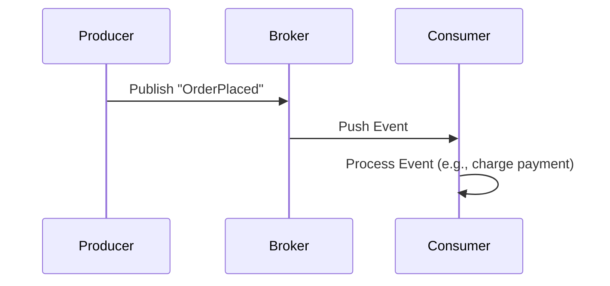

---
cssclasses:
  - center-images
  - center-titles
---
Tags: #system-design

# 12_System Design

# **Event-Driven Architecture (EDA) - Comprehensive Guide**  

---

## **1. What is Event-Driven Architecture?**  
**Definition**:  
A design pattern where system components communicate via **asynchronous events** (state changes) rather than direct API calls.  

**Key Idea**:  
- Components **produce** or **consume** events (e.g., "OrderPlaced", "PaymentFailed").  
- Decouples services: Producers don’t know who processes their events.  

**Analogy**:  
Like a **newspaper subscription**:  
- **Publisher** (news agency) sends papers → **Subscribers** (readers) receive only what they signed up for.  

---

## **2. Core Concepts**  
### **A. Event**

A **state change** or significant occurrence, represented as:  

```json
{
  "event_id": "123",
  "type": "OrderShipped",
  "timestamp": "2023-05-20T12:00:00Z",
  "data": { "order_id": 456, "status": "shipped" }
}
```

### **B. Event Producer**  
Services that **emit events** (e.g., Order Service publishes `OrderCreated`).  

### **C. Event Consumer**  
Services that **react to events** (e.g., Inventory Service listens for `OrderCreated` to reduce stock).  

### **D. Event Broker**  
Middleware that routes events:  
- **Message Queues** (RabbitMQ): Point-to-point.  
- **Event Streams** (Kafka): Persistent, pub/sub.  

---

## **3. How EDA Works**  



**Steps**:  
1. Producer emits an event to the broker.  
2. Broker routes it to interested consumers.  
3. Consumers process events **asynchronously**.  

---

## **4. Key Patterns**  
### **A. Event Notification**  
- Simple alerts (e.g., "UserLoggedIn" → update analytics).  
- **Tools**: RabbitMQ, AWS SNS.  

### **B. Event Sourcing**  
- Stores **all state changes** as events (like a ledger).  
- Rebuild state by replaying events:  

  ```mermaid
  flowchart LR
      A[OrderCreated] --> B[PaymentProcessed] --> C[OrderShipped]
  ```

### **C. CQRS (Command Query Responsibility Segregation)**  
- **Separate read/write databases**: 

  ```mermaid
  graph TB
      subgraph Write
          W[Command] --> ES[Event Store]
      end
      subgraph Read
          ES --> R[Read DB] --> Q[Query]
      end
  ```

### **D. Saga Pattern**  
- Manages **distributed transactions** via event sequences:  

  ```mermaid
  flowchart LR
      A[OrderCreated] --> B[PaymentProcessed]
      B -->|Success| C[InventoryUpdated]
      B -->|Failure| D[OrderCancelled]
  ```

---

## **5. Benefits**  
✅ **Loose Coupling**: Services evolve independently.  
✅ **Scalability**: Consumers scale horizontally.  
✅ **Real-Time**: React instantly to changes (e.g., live dashboards).  
✅ **Fault Tolerance**: Failed events can retry.  

---

## **6. Challenges**  
⚠ **Complex Debugging**: Hard to trace event flows.  
⚠ **Event Ordering**: Must handle out-of-order events (e.g., Kafka partitions).  
⚠ **Idempotency**: Process duplicate events safely.  

---

## **7. Real-World Examples**  
| **System**    | **EDA Use Case**                            |     |
| ------------- | ------------------------------------------- | --- |
| **Uber**      | Real-time driver/rider matching (Kafka).    |     |
| **Netflix**   | User activity tracking (play/pause events). |     |
| **eCommerce** | Order → Inventory → Shipping workflows.     |     |

---

## **8. EDA vs. Request-Driven**  
| **Aspect**         | **EDA**                       | **Request-Driven (REST)**        |     |
| ------------------ | ----------------------------- | -------------------------------- | --- |
| **Coupling**       | Loose (producers ≠ consumers) | Tight (services call each other) |     |
| **Latency**        | Low (async)                   | High (sync blocking)             |     |
| **Error Handling** | Retries/DLQs                  | Immediate failures               |     |

---

## **9. Tools & Technologies**  
| **Tool**            | **Use Case**                     |     |
| ------------------- | -------------------------------- | --- |
| **Apache Kafka**    | High-throughput event streaming. |     |
| **RabbitMQ**        | Traditional message brokering.   |     |
| **AWS EventBridge** | Serverless event bus.            |     |

---

## **10. When to Use EDA?**  
✔ **Real-time systems** (IoT, fraud detection).  
✔ **Decoupled microservices**.  
✔ **High-volume data streams** (logs, analytics).  

❌ **Avoid for**:  
- Simple CRUD apps.  
- Systems needing strong consistency.  

---

### **Summary Cheat Sheet**  
1. **Events** = State changes (e.g., `OrderPlaced`).  
2. **Brokers** route events (Kafka/RabbitMQ).  
3. **Patterns**: Event Sourcing, CQRS, Saga.  
4. **Use Cases**: Real-time, scalable, decoupled systems.  
