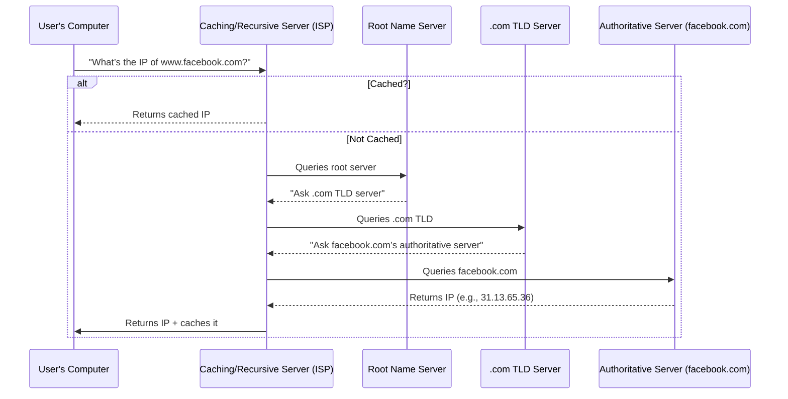
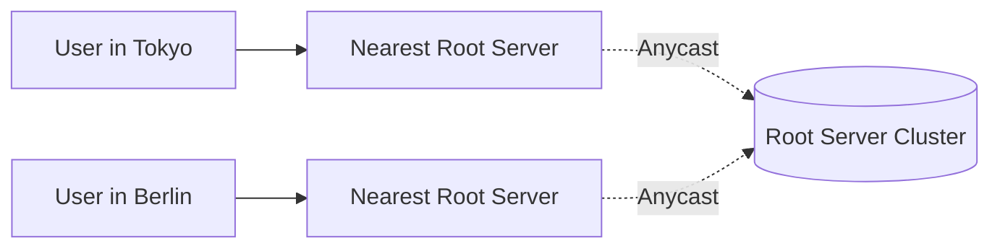
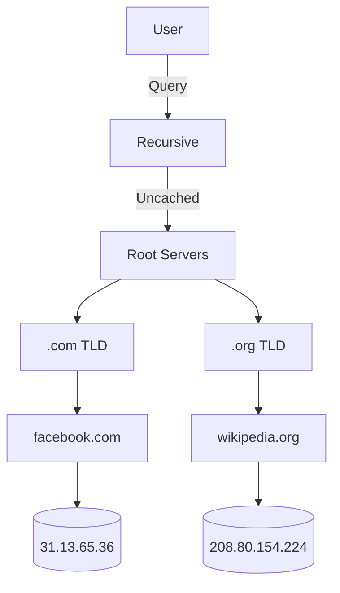

---
cssclasses:
  - center-images
  - center-titles
---
Tags: #network

# 14_DNS

### **Key Takeaways About DNS:**

1. **Human-Friendly Naming**  
   - Computers communicate via **IP addresses** (e.g., `184.29.131.121`), but humans remember **domain names** (e.g., `www.weather.com`) more easily.  
   - DNS acts like a **phonebook for the internet**, translating domain names into IP addresses.

2. **Dynamic & Flexible**  
   - IP addresses for a domain can change (e.g., due to server migrations, load balancing, or outages).  
   - DNS allows these changes **without requiring end users to update anything**—they keep using the same domain name.

3. **Global & Distributed System**  
   - DNS is **highly decentralized**, with servers worldwide ensuring reliability and speed.  
   - Responses can vary based on **geolocation** (e.g., a user in New York gets a different IP than one in Delhi for the same domain), improving performance via **Content Delivery Networks (CDNs)**.

4. **Critical for IT & Troubleshooting**  
   - Understanding DNS helps diagnose **connectivity issues** (e.g., "Can you ping the IP but not the domain? Then it’s likely a DNS problem.").  
   - Common tools for troubleshooting:  
     - `nslookup` / `dig` (DNS resolution checks)  
     - `ping` (tests connectivity to an IP/domain)  
     - `traceroute` (identifies routing delays).

### **Why DNS is Indispensable:**

- Without DNS, we’d have to memorize **numerical IPs for every website**—an impractical task.  
- It enables **scalability** (e.g., cloud services, failover systems) and **load balancing** (distributing traffic across servers).  
- Supports security mechanisms like **DNSSEC** (DNS Security Extensions) to prevent spoofing.

### **Example Workflow:**
1. You type `www.weather.com` → Your computer queries a **DNS resolver** (often your ISP or a service like Google DNS).  
2. The resolver checks **root servers**, **TLD servers** (.com), and **authoritative servers** (weather.com’s DNS) to find the IP.  
3. The IP is returned (e.g., `184.29.131.121`), and your browser connects to it.

### **Common DNS Issues:**
- **Misconfigured records** (e.g., missing or incorrect A/CNAME records).  
- **Propagation delays** (changes to DNS can take hours to update globally).  
- **DNS cache poisoning** (malicious redirection via corrupted cache).  

---

### DNS is a system to converts Domain names into IP addresses.

# Name Resolution

- Process of using DNS to turn a domain name into a IP address is known as name resolution.

---

### **1. DNS Basics**
- **Purpose**: Translates human-readable domain names (e.g., `www.facebook.com`) into machine-readable IP addresses (e.g., `31.13.65.36`).  
- **Name Resolution**: The process of converting a domain name to an IP address via DNS.

---

### **2. Essential Network Configuration**
For a device to operate on a network, four elements must be configured:  
1. **IP Address**  
2. **Subnet Mask**  
3. **Default Gateway**  
4. **DNS Server** *(Critical for name resolution)*  

> 💡 *Without DNS, users would need to memorize IP addresses for every website.*

---

### **3. Types of DNS Servers**
| Type | Role | Example |
|------|------|---------|
| **Caching Name Server** | Stores DNS responses temporarily to reduce lookup times. | ISP/local network servers |
| **Recursive Name Server** | Performs full DNS resolution (queries root/TLD/authoritative servers). | Google DNS (`8.8.8.8`) |
| **Root Name Server** | Directs queries to TLD servers (13 logical root servers globally). | `a.root-servers.net` |
| **TLD Name Server** | Manages top-level domains (`.com`, `.org`, etc.). | `gtld-servers.net` |
| **Authoritative Name Server** | Holds the final IP for a domain (controlled by the domain owner). | `ns1.facebook.com` |

---

### **4. How DNS Resolution Works**
#### **Example**: Resolving `www.facebook.com`

#### **Key Steps**:
1. **Local Cache Check**: If the IP is cached (e.g., from a previous query), return it immediately.  
2. **Recursive Query**: If uncached, the recursive server queries:  
   - **Root Server** → **TLD Server** (`.com`) → **Authoritative Server** (`facebook.com`).  
3. **Response**: The authoritative server returns the IP, which is cached for future requests.

---

### **5. Time-to-Live (TTL)**
- **Definition**: A timer (in seconds) set by domain owners to control how long DNS records can be cached.  
  - *Example*: A TTL of `3600` (1 hour) means cached entries expire after 1 hour.  
- **Impact**: Shorter TTLs allow faster updates but increase DNS traffic. Longer TTLs reduce queries but delay propagation of changes.

---

### **6. Anycast & Global Distribution**
- **Root/TLD Servers**: Use **anycast** to route queries to the nearest physical server (not just 13 physical machines).  
- **Benefits**: Reduces latency and improves fault tolerance.  

---

### **7. Why Hierarchy Matters**
- **Security**: Prevents malicious redirection by enforcing trusted root → TLD → authoritative chain.  
- **Stability**: Ensures consistent responses globally.  

---

### **8. Caching Everywhere**
- **Local Device Cache**: Your computer/phone caches DNS to avoid repeated queries.  
- **ISP Cache**: Recursive servers cache responses to speed up future requests.  

---

### **Troubleshooting DNS Issues**
- **Tools**:  
  - `nslookup www.facebook.com` (Check DNS resolution).  
  - `ipconfig /flushdns` (Clear local cache on Windows).  
- **Common Problems**:  
  - **Propagation Delays**: Changes take time to reflect globally (due to TTLs).  
  - **Misconfigured Records**: Incorrect A/CNAME entries.  

---

### **Mermaid Diagram: Full DNS Hierarchy**

---

### **Summary**
- DNS is **hierarchical** (Root → TLD → Authoritative).  
- **Caching** (local + ISP) minimizes redundant lookups.  
- **Anycast** ensures low-latency global access.  
- **TTLs** balance speed vs. consistency.
