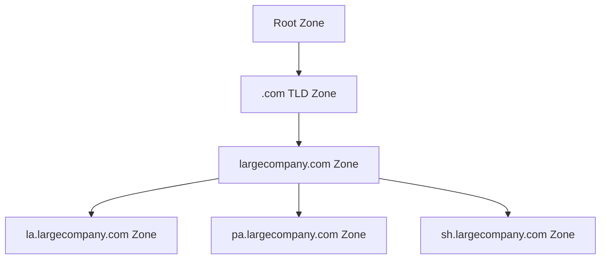

---
cssclasses:
  - center-images
  - center-titles
---
Tags: #network

# 15_Domain Name


---

### **1. Top-Level Domain (TLD)**
- **Purpose**: The highest level in the DNS hierarchy.  
- **Example**: `.com` in `www.google.com`.  
- **Key Facts**:  
  - **Restricted List**: Managed by **ICANN** (Internet Corporation for Assigned Names and Numbers).  
  - **Types**:  
    - **Generic TLDs (gTLDs)**: `.com`, `.net`, `.edu`, `.org`.  
    - **Country-Code TLDs (ccTLDs)**: `.de` (Germany), `.cn` (China).  
    - **Vanity TLDs**: `.pizza`, `.museum`, `.ai` (added recently due to demand).  
  - **Registration**: ICANN delegates TLD management to registrars (e.g., GoDaddy, Namecheap).  

---

### **2. Domain (Second-Level Domain)**
- **Purpose**: Identifies the organization/entity under the TLD.  
- **Example**: `google` in `www.google.com`.  
- **Key Facts**:  
  - **Registration**: Purchased from registrars (e.g., `google.com` is owned by Google LLC).  
  - **Control**: The domain owner manages **authoritative DNS servers** for it.  
  - **Uniqueness**: Must be unique per TLD (e.g., `google.com` vs. `google.org`).  

---

### **3. Subdomain (Hostname)**
- **Purpose**: Further divides the domain for specific services/hosts.  
- **Example**: `www` in `www.google.com`.  
- **Key Facts**:  
  - **Flexibility**: Created freely by the domain owner (e.g., `mail.google.com`, `docs.google.com`).  
  - **Common Uses**:  
    - `www`: Traditional web hosting.  
    - `api`: API endpoints.  
    - `blog`: Separate content hub.  
  - **Technical Limits**:  
    - Max **127 levels** (e.g., `a.b.c.d...x127.example.com`).  
    - Each segment ≤ **63 characters**; total FQDN ≤ **255 characters**.  

---

### **Fully Qualified Domain Name (FQDN)**

- **Definition**: The complete domain name, including all subdomains, domain, and TLD.  
  - Example: `www.google.com` or `host.subsubdomain.domain.com`.  
- **Hierarchy Visualization**:  

  ```mermaid
  graph LR
    A[TLD: .com] --> B[Domain: google]
    B --> C[Subdomain: www]
    B --> D[Subdomain: mail]
    B --> E[Subdomain: docs]
  ```

---

### **ICANN’s Role**
- **Governance**: Oversees TLDs, IP allocation, and DNS root servers.  
- **Sister to IANA**: Manages global IP/DNS coordination.  

---

### **Practical Implications**
1. **Buying a Domain**:  
   - Register `yourdomain.com` via a registrar (costs ~$10–$50/year).  
   - Create unlimited subdomains (e.g., `shop.yourdomain.com`).  

2. **DNS Control**:  
   - Domain owners configure **authoritative DNS servers** to point subdomains to IPs.  

3. **Real-World Examples**:  
   - `maps.google.com` (subdomain for Google Maps).  
   - `bbc.co.uk` (ccTLD + second-level domain).  

---

### **Common Pitfalls**
- **Typos**: `gogle.com` (squatting risk).  
- **Overly Long Domains**: Hard to remember (e.g., `this.is.a.very.long.subdomain.example.com`).  

# DNS Zones

---

### **1. DNS Zones: Hierarchical Control**

- **Definition**: A **DNS zone** is an administrative segment of the DNS namespace, managed by authoritative name servers.  
- **Purpose**: Delegates control over subsets of a domain to simplify management (e.g., splitting `largecompany.com` by offices).  
- **Non-Overlapping**: Zones are distinct—authority ends where another zone begins (e.g., `.com` TLD zone doesn’t include `google.com`).  

#### **Zone Hierarchy Example**:



---

### **2. Zone Files: Configuration Blueprints**

Each zone is defined by a **zone file**, containing:  

1. **SOA Record (Start of Authority)**  
   - Declares the zone’s authoritative name server and admin contact.  
   - Includes serial numbers (for version tracking), refresh intervals, and TTL defaults.  
   - Example:  
     ```
     @ IN SOA ns1.largecompany.com. admin.largecompany.com. (
         2024041801 ; Serial
         3600       ; Refresh
         1800       ; Retry
         604800     ; Expire
         86400 )    ; Minimum TTL
     ```

2. **NS Records (Name Server)**  
   - Lists all authoritative servers for the zone.  
   - Example:  
     ```
     @ IN NS ns1.largecompany.com.
     @ IN NS ns2.largecompany.com.
     ```

3. **Other Common Records**  
   - **A/AAAA**: Map hostnames to IPv4/IPv6 addresses.  
   - **CNAME**: Aliases (e.g., `www` → `webserver.largecompany.com`).  
   - **MX**: Mail servers.  

---

### **3. Why Split Zones?**

- **Scalability**: Managing 600 A records in one zone (e.g., `largecompany.com`) is cumbersome.  
- **Local Control**: Offices in LA, Paris, Shanghai can manage their own sub-zones (`la.largecompany.com`, etc.).  
- **Fault Isolation**: Zone-specific issues (e.g., misconfiguration) don’t affect the entire domain.  

#### **Before vs. After Zone Splitting**:
| **Single Zone** | **Split Zones** |
|-----------------|-----------------|
| 1 zone file (`largecompany.com`) | 4 zone files (parent + 3 subdomains) |
| 600 A records | ~200 A records per sub-zone |
| Single point of failure | Distributed management |

---

### **4. Reverse Lookup Zones (PTR Records)**
- **Purpose**: Resolves IPs → FQDNs (opposite of A records).  
- **Usage**: Critical for diagnostics (e.g., `nslookup 192.0.2.1` returns `server1.largecompany.com`).  
- **Format**:  
  - Zone file for `2.0.192.in-addr.arpa` (IPv4 reverse zone):  
    ```
    1 IN PTR server1.largecompany.com.
    2 IN PTR server2.largecompany.com.
    ```

---

### **5. Redundancy & Best Practices**
- **Multiple Name Servers**:  
  - At least two authoritative servers per zone (e.g., `ns1.largecompany.com`, `ns2.largecompany.com`).  
  - Prevents downtime if one fails.  
- **TTL Management**:  
  - Lower TTLs (e.g., 300s) for frequently changed records.  
  - Higher TTLs (e.g., 86400s) for stable records.  

---

### **Key Takeaways**
1. **Zones ≠ Domains**: A zone is an administrative unit; a domain is a namespace.  
2. **SOA Records**: The "source of truth" for a zone.  
3. **Sub-Zoning**: Improves scalability (e.g., geo-distributed offices).  
4. **Reverse DNS**: Requires PTR records in dedicated reverse zones.  

Need a real-world example of a zone file or deeper dive into **DNSSEC**? Let me know!
