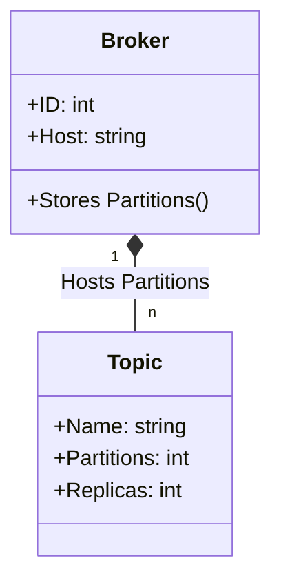
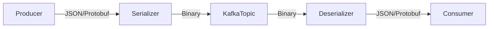
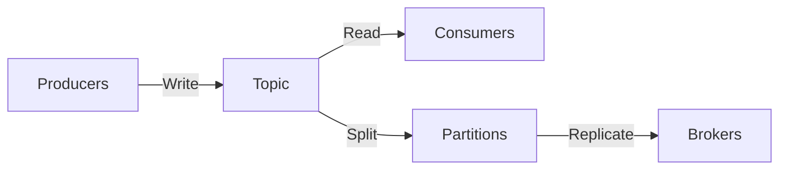
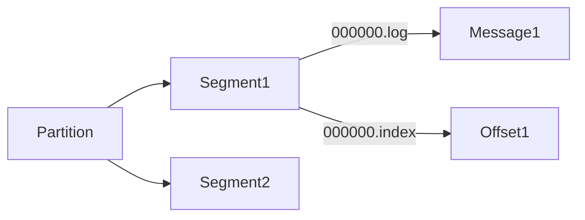
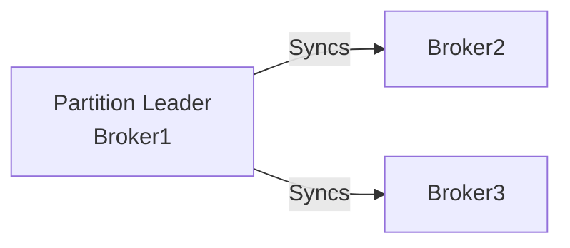

---
cssclasses:
  - center-images
  - center-titles
---
Tags: #kafka

## Topic Vs Broker 




---

## Message
### **1. Message Basics**  
- **Message = Record = Event = Data**  
- **Formats**: JSON, String, Protobuf, Avro (Binary preferred for efficiency).  
- **Flow**:  



- **Tip**: Use **Protobuf/Avro** (smaller size, faster than JSON).  
### **2. Message Key Strategy**  
- **Same Key** → Same partition (order preserved, but risks bottleneck).  
- **Null Key** → Auto-balance across partitions (scales better, no ordering).  
- **Smart Key** → Hash-based (e.g., `user_id % partitions`) for balance + order.  

### **3. Pro Tip**  
- **Trade-off**: Order (fixed key) vs. Throughput (null/balanced key).  
- **Use Case**:  
  - Payments → Same key (strict order).  
  - Logs → Null key (max throughput).  

# Topic




#### **1. What’s a Topic?**
- **Database Table** → Kafka Topic  
- **Table Row** → Kafka Message  
- **Always** multi-producer/multi-consumer (unlike queues)  

#### **2. Must-Create First**  
```bash
kafka-topics --create \
  --topic orders \
  --partitions 3 \          # Parallelism
  --replication-factor 2 \  # Fault tolerance
  --bootstrap-server kafka:9092
```

#### **3. Immutable Log Structure**  

- Append-only (no updates/deletes)  
- Ordered within partitions only  

#### **4. Pro Tips**  
- **Throughput?** ↑ Partitions = ↑ Parallelism  
- **Order?** Same key = Same partition  
- **HA?** Replication factor ≥ 2  


## Partitions
- A Topic is a higher-level abstruction that consists of partitions.
- Partition is a discrete log file wriien to the local kafka broker
- Messages with the same key are published to the same partition.
- Kafka ensures that any reader of a given consumes messages in the order they published
- Kafka can replicate partitions across different brokers. 

![[Kafka_Partition.png]]


# 1_Architecture


Apache Kafka is a distributed event streaming platform capable of handling trillions of events per day. Let's dive deep into its architecture, components, and how they work together.

## Core Architecture Components

### 1. Fundamental Kafka Architecture Diagram

```
[Producers]  →  [Kafka Cluster]  →  [Consumers]
                /      |      \
           [Broker1] [Broker2] [Broker3]
             /   \     /   \     /   \
        [TopicA] [TopicB] [TopicC] [TopicD]
           / \       / \       / \       / \
        [Part1] [Part2] [Part1] [Part2] [Part1] [Part2] [Part1] [Part2]
```

## Detailed Components

### 1. Producers
- Applications that publish (write) events to Kafka topics
- Can publish to specific partitions or let Kafka handle partitioning
- Key features:
  - Batching for efficiency
  - Compression (gzip, snappy, lz4, zstd)
  - Retries and idempotent delivery
  - Exactly-once semantics support

### 2. Kafka Cluster
The core distributed system consisting of multiple brokers.

#### Brokers
- Individual Kafka servers that store data and serve clients
- Each broker is identified by an integer ID
- Responsibilities:
  - Receiving messages from producers
  - Assigning offsets to messages
  - Persisting messages to disk
  - Serving messages to consumers
  - Handling replication

### 3. Topics and Partitions

```
[Topic: "Orders"]
├── [Partition 0] (Leader: Broker1, Followers: Broker2, Broker3)
├── [Partition 1] (Leader: Broker2, Followers: Broker1, Broker3)
└── [Partition 2] (Leader: Broker3, Followers: Broker1, Broker2)
```

- **Topics**: Categories or feeds to which records are published
- **Partitions**:
  - Topics are split into partitions for parallelism and scalability
  - Each partition is an ordered, immutable sequence of records
  - Records in a partition are assigned a sequential ID called an offset
  - Partitions are replicated across brokers for fault tolerance

### 4. Replication and ISRs (In-Sync Replicas)



- Each partition has one leader and zero or more followers
- Followers replicate the leader's log
- ISRs are replicas that are fully caught up with the leader
- If leader fails, a new leader is elected from ISRs

### 5. Consumers and Consumer Groups

```
[Consumer Group A]
├── Consumer1 (assigned Partitions 0,1)
└── Consumer2 (assigned Partition 2)

[Consumer Group B]
└── Consumer3 (assigned Partitions 0,1,2)
```

- Consumers read data from topics
- Consumer Groups:
  - Multiple consumers can form a group for parallel processing
  - Each partition is consumed by only one consumer in the group
  - Consumers track their position (offset) in each partition

## Data Flow Architecture

```
[Producers] → [Kafka Cluster] → [Consumers] → [External Systems]
    ↑               |                ↑
    |               |                |
[Schema Registry]   |         [Stream Processors]
                    |
              [Zookeeper Ensemble]
                    |
              [Monitoring/Metrics]
```

## Storage Architecture

### Kafka Log Structure

```
partition_folder/
├── 00000000000000000000.log  (actual message data)
├── 00000000000000000000.index (offset → position mapping)
├── 00000000000000000000.timeindex (timestamp → offset mapping)
└── leader-epoch-checkpoint
```

- Append-only log segments
- Index files for fast lookup
- Configurable retention policies (time-based, size-based)
- Compaction for key-based retention

## Advanced Components

### 1. Zookeeper (pre-Kafka 3.0)

```
[Zookeeper Ensemble]
├── Broker metadata (alive brokers, topics, partitions)
├── Controller election
├── ACLs (Access Control Lists)
└── Configuration storage
```

Note: Kafka 3.0+ can run without Zookeeper (KRaft mode)

### 2. Kafka Connect

```
[Source Systems] → [Kafka Connect (Source)] → [Kafka] → [Kafka Connect (Sink)] → [Sink Systems]
```

- Framework for streaming data between Kafka and other systems
- Hundreds of existing connectors
- Distributed and standalone modes

### 3. Kafka Streams

```
[Kafka Topic] → [Kafka Streams App] → [Processed Kafka Topic]
```
- Library for building stream processing applications
- Stateful operations with exactly-once semantics
- Integrated with Kafka's security and monitoring

## Fault Tolerance Mechanisms

1. **Replication**: Data is replicated across multiple brokers
2. **Leader Election**: Automatic failover when a broker goes down
3. **ISR Mechanism**: Ensures only in-sync replicas can become leaders
4. **Durability**: Messages are persisted to disk before acknowledgment
5. **End-to-end Exactly-once**: From producer to broker to consumer

## Performance Optimizations

1. **Zero-copy**: Bypasses user-space buffers when sending data
2. **Batching**: Accumulates messages for more efficient network transfer
3. **Compression**: Reduces network and storage overhead
4. **Partitioning**: Enables horizontal scalability
5. **Sequential I/O**: Leverages disk performance characteristics

## Security Architecture

```
[Client] → [SSL/TLS] → [Authentication (SASL)] → [Authorization (ACLs)] → [Broker]
```

1. **Encryption**: SSL/TLS for data in transit
2. **Authentication**: SASL mechanisms (PLAIN, SCRAM, GSSAPI)
3. **Authorization**: Fine-grained access control lists (ACLs)
4. **Auditing**: Operations logging

## Monitoring and Management

1. **JMX Metrics**: Thousands of metrics exposed via JMX
2. **Kafka Manager**: Web UI for cluster management
3. **Cruise Control**: Automated workload balancing
4. **Prometheus/Grafana**: Popular monitoring stack

![[Kafka_Architecture.png]]

## Topic Vs Broker 


---

## Message
### **1. Message Basics**  
- **Message = Record = Event = Data**  
- **Formats**: JSON, String, Protobuf, Avro (Binary preferred for efficiency).  
- **Flow**:  


- **Tip**: Use **Protobuf/Avro** (smaller size, faster than JSON).  
### **2. Message Key Strategy**  
- **Same Key** → Same partition (order preserved, but risks bottleneck).  
- **Null Key** → Auto-balance across partitions (scales better, no ordering).  
- **Smart Key** → Hash-based (e.g., `user_id % partitions`) for balance + order.  

### **3. Pro Tip**  
- **Trade-off**: Order (fixed key) vs. Throughput (null/balanced key).  
- **Use Case**:  
  - Payments → Same key (strict order).  
  - Logs → Null key (max throughput).  

# Topic


#### **1. What’s a Topic?**
- **Database Table** → Kafka Topic  
- **Table Row** → Kafka Message  
- **Always** multi-producer/multi-consumer (unlike queues)  

#### **2. Must-Create First**  
```bash
kafka-topics --create \
  --topic orders \
  --partitions 3 \          # Parallelism
  --replication-factor 2 \  # Fault tolerance
  --bootstrap-server kafka:9092
```

#### **3. Immutable Log Structure**  

- Append-only (no updates/deletes)  
- Ordered within partitions only  

#### **4. Pro Tips**  
- **Throughput?** ↑ Partitions = ↑ Parallelism  
- **Order?** Same key = Same partition  
- **HA?** Replication factor ≥ 2  


## Partitions
- A Topic is a higher-level abstruction that consists of partitions.
- Partition is a discrete log file wriien to the local kafka broker
- Messages with the same key are published to the same partition.
- Kafka ensures that any reader of a given consumes messages in the order they published
- Kafka can replicate partitions across different brokers. 

![[Kafka_Partition.png]]

- If broker fails, the controller reassigns the leader for that partition to a different broker and redirects producers and consumers to use a different broker.


## Publishers
- The client applications that publish (write) events to kafka. 
- Producers distribute data to topics by selecting the appropriate partition within the topic. They allocate message sequentically to the topic partition
- Producers distribute messages across all partitions of a topic. 

![[Kafka_Producers.png]]
![[Kafka_Message.png]]


## Consumers
- Consumers are applications that subscribe to topics and process published messages
- consumers == readers
- They read the messages in the order in which they were generated.
- A consumer uses offset to track which messages it has already consumed.
- It stores the offset of the last consumed message for each partition so it can stop and restart without losing its place
- Consumer group ensumers 1 member only consumes 1 partition
- If 1 consumer fails remaining members reorganize to compensate for the absent member

![[Kafka_Consumer.png]]

## Broker
- Broker == Single Kafka Server
- It receives messages for producers, assign them offsets, and commit the messages to disk storage
- An offset is a unique integer value that kafka increments and adds to each message as it's published.
- Offsets are unique for each partition and are critical for maintaining data consistency in the event of a failure or outage
- Kafka writes every single message to the local disk, to increase performance make sure that attach fast SSD disks to brokers

## Controller
- A **Kafka controller is a broker** with extra responsibilities.
- Every cluster has single active kafka controller. 
- Responsible for managing partitions and replicas and performing some administrative tasks, such as reassigning partitions
- **Leader election** of partitions.
- **Detecting broker failures**.
- **Reassigning partition leaders** if a broker goes down.
- Managing **topic creation, deletion, and partition assignments**.
