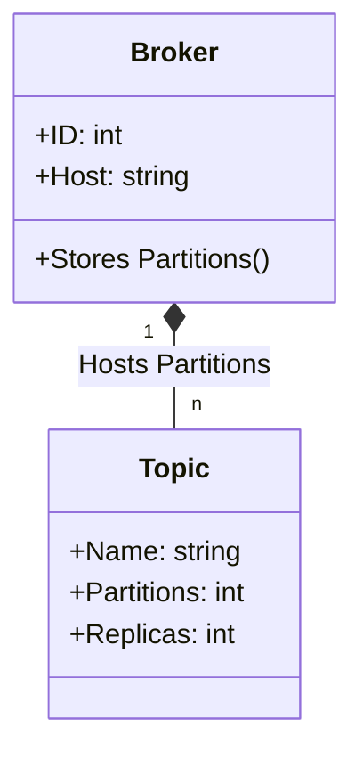
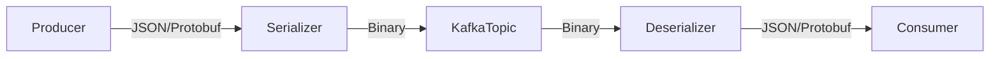
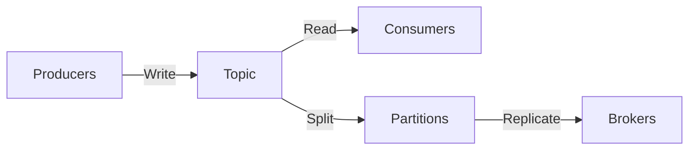
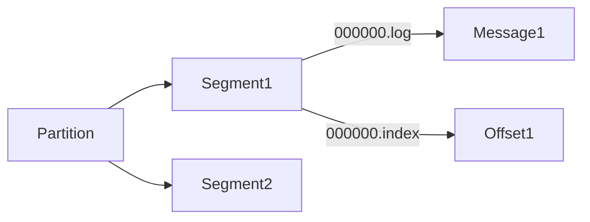

---
cssclasses:
  - center-images
  - center-titles
---
Tags: #docker, #containergo

## Topic Vs Broker 




---

## Message
### **1. Message Basics**  
- **Message = Record = Event = Data**  
- **Formats**: JSON, String, Protobuf, Avro (Binary preferred for efficiency).  
- **Flow**:  



- **Tip**: Use **Protobuf/Avro** (smaller size, faster than JSON).  
### **2. Message Key Strategy**  
- **Same Key** → Same partition (order preserved, but risks bottleneck).  
- **Null Key** → Auto-balance across partitions (scales better, no ordering).  
- **Smart Key** → Hash-based (e.g., `user_id % partitions`) for balance + order.  

### **3. Pro Tip**  
- **Trade-off**: Order (fixed key) vs. Throughput (null/balanced key).  
- **Use Case**:  
  - Payments → Same key (strict order).  
  - Logs → Null key (max throughput).  

# Topic




#### **1. What’s a Topic?**
- **Database Table** → Kafka Topic  
- **Table Row** → Kafka Message  
- **Always** multi-producer/multi-consumer (unlike queues)  

#### **2. Must-Create First**  
```bash
kafka-topics --create \
  --topic orders \
  --partitions 3 \          # Parallelism
  --replication-factor 2 \  # Fault tolerance
  --bootstrap-server kafka:9092
```

#### **3. Immutable Log Structure**  

- Append-only (no updates/deletes)  
- Ordered within partitions only  

#### **4. Pro Tips**  
- **Throughput?** ↑ Partitions = ↑ Parallelism  
- **Order?** Same key = Same partition  
- **HA?** Replication factor ≥ 2  


## Partitions
- A Topic is a higher-level abstruction that consists of partitions.
- Partition is a discrete log file wriien to the local kafka broker
- Messages with the same key are published to the same partition.
- Kafka ensures that any reader of a given consumes messages in the order they published
- Kafka can replicate partitions across different brokers. 

![[Kafka_Partition.png]]


# Control Groups (cgroups)

## Overview
Control Groups, commonly referred to as **cgroups**, are a Linux kernel feature that allows you to allocate, manage, and limit system resources (such as CPU, memory, disk I/O, and network bandwidth) among user-defined groups of processes. Cgroups are essential for resource management in containerized environments like Docker and Kubernetes.

## Key Features
- **Resource Limitation**: Restrict the amount of resources a group of processes can use.
- **Prioritization**: Allocate more resources to certain groups.
- **Accounting**: Monitor and track resource usage.
- **Control**: Freeze, checkpoint, and restart groups of processes.

## Cgroups Versions
- **cgroups v1**: The original implementation, which has some limitations in terms of hierarchy and resource management.
- **cgroups v2**: A newer version that addresses many of the shortcomings of v1, providing a unified hierarchy and improved resource management.

## Common Subsystems (Controllers)
Cgroups are organized into subsystems (also called controllers), each responsible for managing a specific type of resource:
- **cpu**: Limits CPU usage.
- **memory**: Controls memory allocation and usage.
- **blkio**: Manages block I/O (disk access).
- **net_cls**: Tags network packets for traffic control.
- **devices**: Controls access to devices.
- **freezer**: Suspends or resumes groups of processes.

## Basic Commands
### Listing Cgroups
```bash
$ ls /sys/fs/cgroup/
