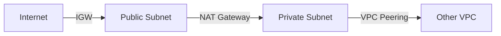
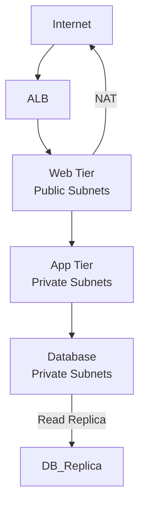
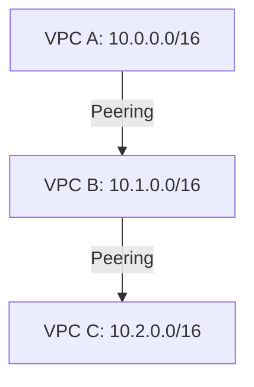

---
cssclasses:
  - center-images
  - center-titles
---
Tags: #aws

# Networking

Here's an improved and expanded version of your AWS networking notes in Markdown format for Obsidian:

```markdown
# AWS Networking Fundamentals

## VPC (Virtual Private Cloud)
- **Scope**: Regional resource (spans all AZs in a region)
- **CIDR**: Private IP address range (e.g., 10.0.0.0/16)
- **Components**:
  - Subnets (AZ-level)
  - Route Tables
  - Network ACLs
  - Security Groups
  - Gateways

## Core Components

### Subnets
- **Public Subnets**:
  - Has route to Internet Gateway (IGW)
  - Hosts public-facing resources (Load Balancers, NAT Gateways, Bastion Hosts)
  - Example use case: Web servers in public subnets
  
- **Private Subnets**:
  - No direct internet access
  - Uses NAT Gateway for outbound internet
  - Hosts backend services (Databases, Application Servers)
  - Example: RDS instances in private subnets

### Routing


### Key Services
1. **Internet Gateway (IGW)**
   - Enables internet access for public subnets
   - Provides 1:1 NAT for instances with public IPs
   - Horizontally scaled, highly available

2. **NAT Gateway**
   - Allows private subnets to initiate outbound connections
   - Managed service (vs. self-managed NAT instances)
   - Charged per hour + data processing
   - Deploy in public subnet with Elastic IP

3. **Route Tables**
   - VPC has main route table (default)
   - Can create custom route tables
   - Routes evaluated in order (most specific first)

## Advanced Concepts
### Security
- **Network ACLs**: Stateless firewall at subnet level
- **Security Groups**: Stateful firewall at instance level
- **Flow Logs**: Capture IP traffic information

### Connectivity Options
| Service          | Use Case                          | Scope           |
|------------------|-----------------------------------|-----------------|
| VPC Peering      | Connect two VPCs                  | Same/Across Regions |
| Transit Gateway  | Hub-and-spoke topology            | Multi-VPC       |
| Direct Connect   | Dedicated network connection      | On-premises     |
| VPN Connections  | Secure tunnel over public internet| On-premises     |

## Best Practices
1. Use /16 CIDR for production VPCs (65,536 IPs)
2. Reserve /28 subnet for AWS services (e.g., VPC endpoints)
3. Multi-AZ deployment for high availability
4. Separate tiers into different subnets:
   - Web (public)
   - App (private)
   - Data (private with restricted access)

## Example Architecture


## Key Limitations
- VPC CIDR cannot be changed after creation
- Max 5 VPCs per region (soft limit, can be increased)
- Subnet CIDR cannot overlap with other subnets

## Gateway Traffic Flow Comparison

### Internet Gateway (IGW)
- **Direction**: Dual-directional (two-way)
- **Flow**:
  - ✅ **Inbound**: Internet → Public Subnet 
    (e.g., users accessing web servers)
  - ✅ **Outbound**: Public Subnet → Internet 
    (e.g., web servers fetching updates)
- **Key Point**: Requires public IP/Elastic IP on instances

### NAT Gateway
- **Direction**: Uni-directional (one-way only)
- **Flow**:
  - ✅ **Outbound**: Private Subnet → Internet 
    (e.g., database servers downloading patches)
  - ❌ **Inbound**: Internet → Private Subnet 
    (Blocked by design for security)
- **Key Point**: 
  - Uses NAT translation table
  - Private instances don't need public IPs

```mermaid
graph LR
  Internet -->|IGW| PublicSubnet
  PublicSubnet -->|IGW| Internet
  PrivateSubnet -->|NAT| Internet
  Internet -.->|Blocked| PrivateSubnet
  ```

---

## VPC Peering

### **Definition**
- Direct network connection between **two VPCs** (within same or different AWS accounts/regions)
- Enables private communication using **private IP addresses** (no public internet, VPN, or Direct Connect needed)

---

### **Key Properties**
```mermaid
flowchart LR
  A[VPC A] -- Peering Connection --- B[VPC B]
```
1. **Non-Transitive Routing**  
   - If VPC-A ↔ VPC-B and VPC-B ↔ VPC-C, **VPC-A cannot** talk to VPC-C through B.  
   - *(Like introducing two friends doesn’t mean they’ll become friends)*

2. **CIDR Restrictions**  
   - VPCs **must not** have overlapping IP ranges (e.g., both using `10.0.0.0/16`).  
   - *(Solution: Re-design CIDR or use NAT/TGW)*

3. **Region Flexibility**  
   - **Intra-region**: Same region (lower latency)  
   - **Inter-region**: Cross-region (uses AWS backbone)  

4. **No Single Point of Failure**  
   - Redundant infrastructure managed by AWS.

---

### **Use Cases**
| Scenario | Example |
|----------|---------|
| Shared Services | VPC with databases accessed by other VPCs |
| Multi-Account Architecture | Prod VPC (Account A) ↔ Monitoring VPC (Account B) |
| Hybrid Cloud | On-premises (via Direct Connect) → VPC A ↔ VPC B |

---

### **Setup Steps**
1. **Initiate Request**: Owner of VPC-A sends peering request to VPC-B owner.
2. **Accept Request**: VPC-B owner accepts (cross-account requires permissions).
3. **Update Route Tables**: Add routes pointing to the peering connection.
   - Example: In VPC-A’s route table: `10.1.0.0/16 → pcx-12345` (peering ID).

---

### **Limitations & Gotchas**
- **No Edge-to-Edge Routing**: Cannot route via Peering + VPN/Internet Gateway/NAT in one hop.
- **DNS Resolution**: Disabled by default (enable in peering options if needed).
- **Costs**: Inter-region peering charges apply (data transfer fees).

---

### **Security Best Practices**
1. **Least Privilege**: Restrict peering to specific CIDRs in Security Groups/NACLs.
2. **Flow Logs**: Monitor traffic over peering connections.
3. **Tagging**: Label peering connections (e.g., `Env: Prod`, `Owner: Team-X`).

---

### **Alternatives Comparison**
| Feature | VPC Peering | Transit Gateway | VPN |
|---------|-------------|-----------------|-----|
| Max Connections | 125 | Thousands | 1 per VGW |
| Transitive Routing | ❌ | ✅ | ❌ |
| Cross-Region | ✅ | ✅ | ❌ |
| Encryption | ❌ (private AWS network) | ❌ | ✅ (IPSec) |

---

### **Example Architecture**


---

### **Pro Tip**
Use **AWS Resource Access Manager (RAM)** to share peering connections across accounts without manual acceptance.

---
